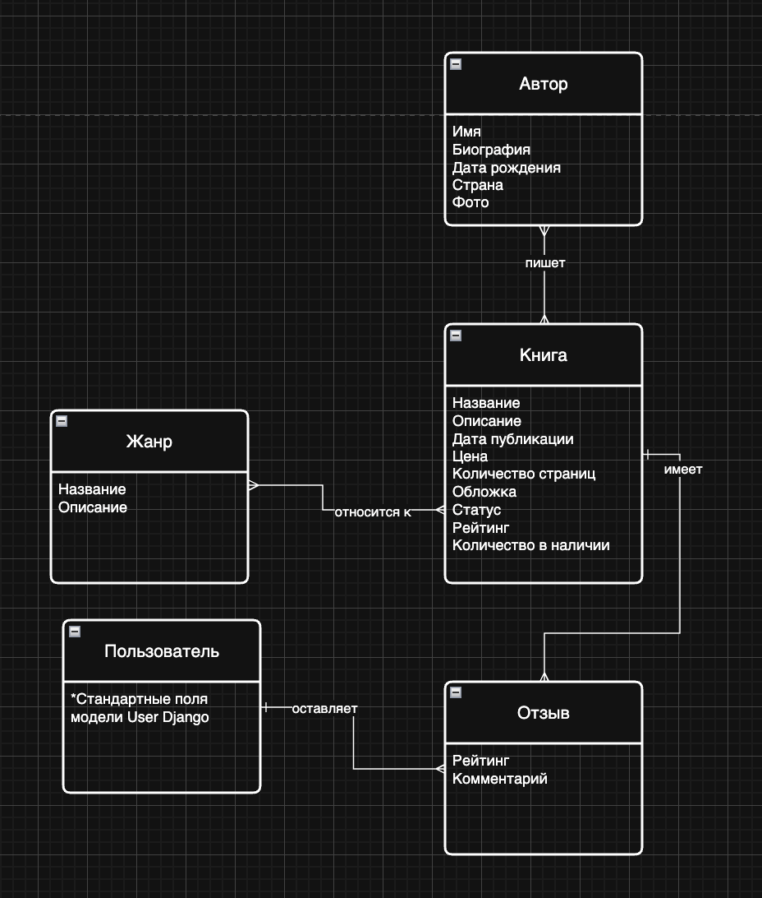
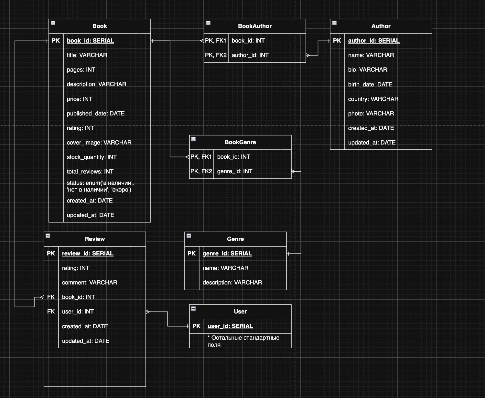
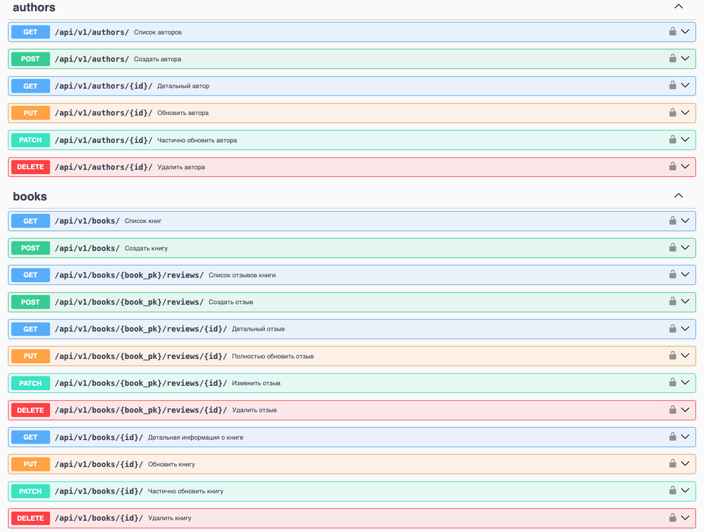
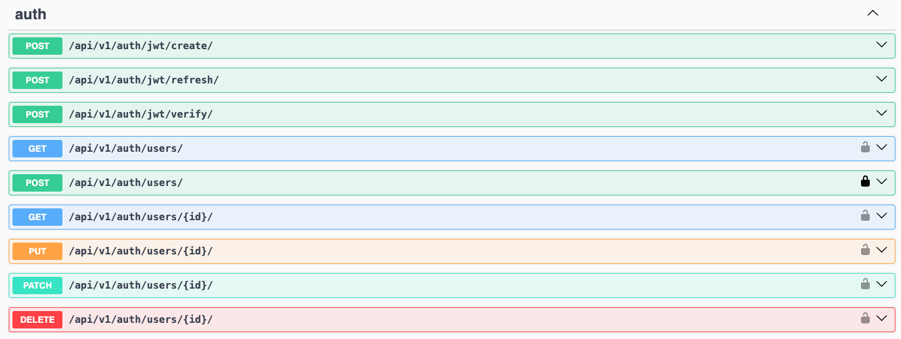

# 📚 Books Shop API
Данный проект выполнен в рамках **тестового задания**.  
Описание задания и требования можно посмотреть по ссылке ниже:

[Текст тестового задания](./docs/task.png)

REST API для интернет-магазина книг с отзывами, рейтингами и ролями пользователей.  
Проект реализован на **Django REST Framework** с JWT-аутентификацией, покрыт тестами и задокументирован через Swagger.

## Архитектура базы данных

Для проекта была спроектирована **ER-диаграмма** и **физическая схема базы данных**, отражающие основные сущности, их атрибуты и связи между ними.

- **ER-диаграмма** демонстрирует логическую модель предметной области и связи между сущностями.
- **Схема БД** отражает физическую структуру таблиц, их поля и связи на уровне базы данных.

### ER-диаграмма


### Схема базы данных


## Возможности

### Аутентификация
- Регистрация пользователей
- JWT аутентификация (access / refresh)
- Роли: **admin** / **user**

### Книги
- Просмотр списка и деталей книг (доступно всем)
- Создание / редактирование / удаление книг (только admin)
- Авторы и жанры (CRUD, admin only)
- Краткая информация об авторах в списке книг

### Отзывы
- Отзывы вложены в книги (`/books/{id}/reviews/`)
- Один пользователь - один отзыв на книгу
- Создание отзыва - только для аутентифицированных
- Изменение / удаление - только автор отзыва
- Валидация рейтинга (1–5)

## API документация

Проект задокументирован с использованием **Swagger (OpenAPI)**.  

#### Эндпоинты работы с книгами и авторами


#### Эндпоинты жанров


#### Аутентификация и пользователи


## Технологии

- **Python 3**
- **Django**
- **Django REST Framework**
- **JWT (djoser / simplejwt)**
- **PostgreSQL**
- **Pytest** (тестирование)
- **Swagger / OpenAPI**

## Запуск проекта
1. **Клонируем репозиторий**  
```
git clone https://github.com/Danila1354/test-task.git  
cd test-task
``` 
2. **Создаем и активируем виртуальное окружение**
```
python3 -m venv venv
source venv/bin/activate
```
3. **Устанавливаем зависимости**
```
pip install -r requirements.txt
```
4. **Настраиваем базу данных**

- Создайте PostgreSQL базу данных и пользователя с правами на эту базу.
- Скопируйте файл `.env.example` в `.env` и укажите свои значения
- После настройки выполните миграции:  
`python manage.py migrate`

5. **Создаем суперпользователя (admin)**
```
python manage.py createsuperuser
```
6. **Запускаем сервер разработки**
```
python manage.py runserver 
```  
После запуска сервер будет доступен по адресу:

http://localhost:8000/  

Документация API доступна по адресу:

http://localhost:8000/api/v1/docs

7. **Тесты**
```
pytest
```

